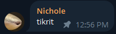
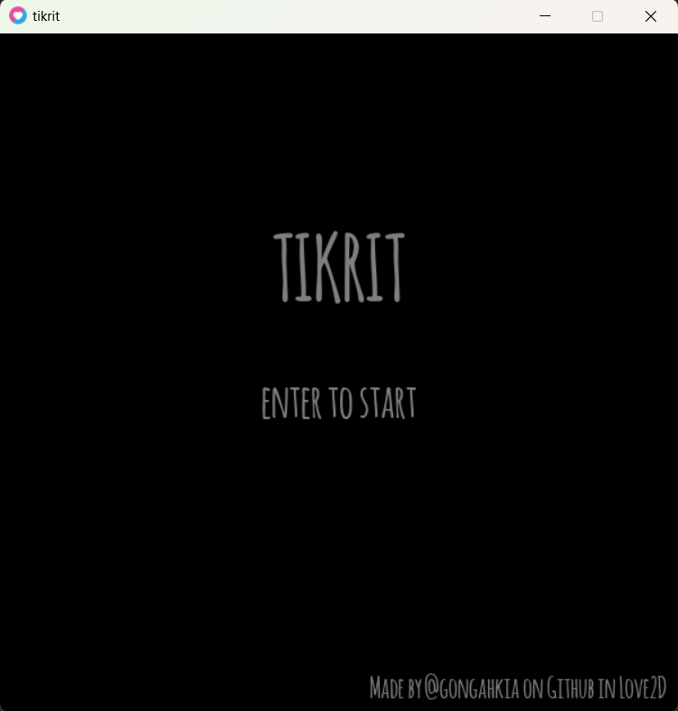
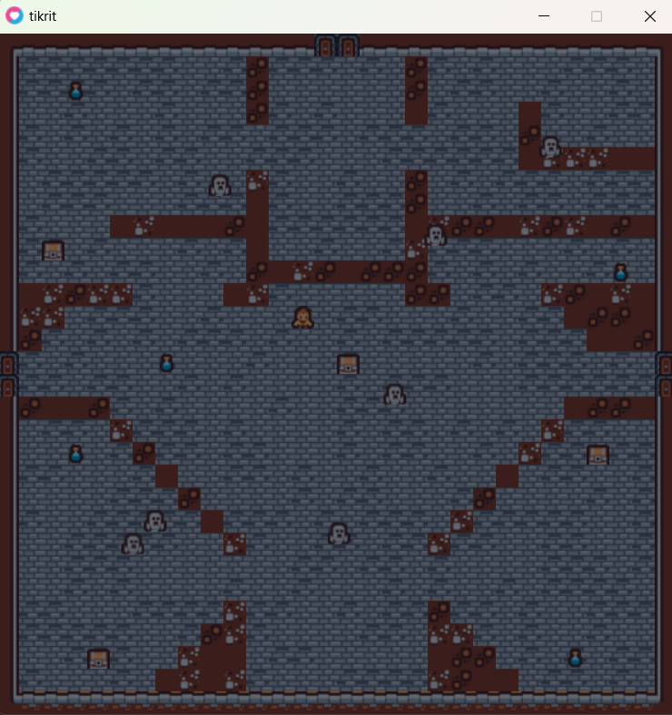

[](https://github.com/gongahkia/tikrit/releases/tag/1.0)
[](https://github.com/gongahkia/tikrit/releases/tag/2.0)

# Tikrit



Tiny horror-ish [roguelike](https://en.wikipedia.org/wiki/Roguelike) written in [Lua](https://www.lua.org/) using Love2D over 5 days.

## Features

### Gameplay
- **Four Difficulty Levels**: Easy, Normal, Hard, and Nightmare modes
- **Daily Challenge Mode**: Fixed seed based on current date - everyone plays the same map each day (toggle with D on title screen)
- **Time Attack Mode**: Race against par times with speed scaling and time bonuses (toggle with T on title screen)
- **Meta-Progression System**: Persistent unlocks between runs - earn permanent upgrades based on total runs, wins, and achievements
- **Inventory System**: Hold up to 3 items and use them strategically with number keys (1-3)
- **Room Hazards**: Spike traps, pressure plates, timed rooms, and dark zones add environmental dangers
- **Fog of War System**: Limited vision radius with memory of previously visited areas
- **Smart Ghost AI**: Two distinct AI behaviors (aggressive chase and territorial patrol)
- **Dynamic Item Effects**: Random effects from potions (speed boost, invincibility, ghost slow, map reveal, etc.)
- **Statistics Tracking**: Track completion time, rooms visited, items used, and deaths
- **Grade System**: S/A/B/C/D ranking based on performance

### Controls
- **Movement**: WASD or Arrow Keys
- **Use Inventory Items**: 1, 2, 3 (use items in inventory slots)
- **Pause**: P or ESC
- **Daily Challenge Toggle**: D (on title screen)
- **Time Attack Toggle**: T (on title screen)
- **View Progression**: P (on title screen - see unlocks and stats)
- **Debug Mode**: F3 (shows FPS, collision boxes, AI vectors, stats)
- **God Mode**: F4 (disable collision for testing)
- **Fog of War Toggle**: F5 (enable/disable during gameplay)
- **Performance Profiler**: F6 (shows FPS graph, frame times, memory usage)
- **Colorblind Mode**: F7 (cycle through colorblind filters)
- **High Contrast Mode**: F8 (toggle high contrast for better visibility)
- **Slow Mode**: F9 (reduce all game speeds by 50% for accessibility)
- **Minimap Toggle**: M (show/hide minimap overlay)
- **Menu Navigation**: Up/Down arrows
- **Menu Selection**: Enter

### HUD
- Key collection progress
- Current room number  
- Inventory display (3 item slots - use with 1, 2, 3 keys)
- Active effect indicators (Invincible, Ghosts Slowed, Map Revealed)
- Minimap overlay (toggle with M) showing current room layout, player position, ghosts, keys, and items

### Developer Features
- **Comprehensive Documentation**: Professional documentation suite (ARCHITECTURE.md, LEVEL_DESIGN.md, MODDING.md, API.md)
- **Automated Testing Framework**: Lightweight testing with 40%+ coverage (Utils, AI, Map Validation) - run with `make test`
- **Configuration-driven Design**: All game parameters in `config.lua`
- **Event System**: Observer pattern for decoupled communication
- **State Machine**: Professional state management framework
- **Modular Architecture**: 14 separate modules with clear responsibilities
- **Debug Visualization**: Collision boxes, AI vectors, performance stats (F3)
- **Performance Profiler**: Frame timing, memory tracking, FPS graph (F6)
- **Accessibility Features**: Colorblind modes (F7), high contrast (F8), slow mode (F9), visual audio indicators
- **Build Pipeline**: Automated cross-platform distribution (makefile, build.sh)

## Documentation

- **[ARCHITECTURE.md](ARCHITECTURE.md)** - Complete system design, module descriptions, data flow diagrams
- **[LEVEL_DESIGN.md](LEVEL_DESIGN.md)** - Map creation guide, design principles, room archetypes, balancing
- **[MODDING.md](MODDING.md)** - Extension guide, custom entities, event system, boss fight example
- **[API.md](API.md)** - Comprehensive function reference for all 14 modules
- **[DISTRIBUTION.md](DISTRIBUTION.md)** - Build instructions for all platforms
- **[CHANGELOG.md](CHANGELOG.md)** - Version history and detailed feature documentation
- **[test/README.md](test/README.md)** - Testing framework guide, writing tests, CI/CD integration

## Testing

```bash
# Run automated test suite
make test

# Or run directly
lua test/run_tests.lua
```

The testing framework includes:
- **Utils Module Tests**: Distance, clamping, coordinate conversion, walkability
- **AI Module Tests**: A* pathfinding, line-of-sight, state transitions
- **Map Validation Tests**: Structure verification, required elements, borders

See [test/README.md](test/README.md) for details on writing and running tests.

## Installation

### CLI

```console
$ git clone https://github.com/gongahkia/tikrit
$ chmod +x install.sh
$ ./install.sh
$ make build # run game
$ make reset # reset maps to fresh state
```

### Building Distribution Packages

```console
$ ./build.sh  # Interactive build script
# OR
$ make love-file  # Create .love file
$ make macos      # Create macOS .app bundle
$ make release    # Build all platforms
```

See [DISTRIBUTION.md](DISTRIBUTION.md) for detailed build instructions.

### GUI

1. Install [Love2D](https://love2d.org/).
2. Open `tikrit` in VSCode.
3. Install the [Love2D Support](https://marketplace.visualstudio.com/items?itemName=pixelbyte-studios.pixelbyte-love2d) VSCode extension.
4. Open `src/main.lua` file.
5. Press `alt + L` key

## Screenshots



Collect the keys to escape.



https://github.com/gongahkia/tikrit/assets/117062305/ef34901c-4873-4069-bbba-dda911497777

## Assets

* Sprites from Kenney's [tiny dungeon](https://kenney.nl/assets/tiny-dungeon) asset pack
* Audio from [OpenGameArt](https://opengameart.org/)
