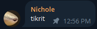

[](https://github.com/gongahkia/tikrit/releases/tag/1.0)
[](https://github.com/gongahkia/tikrit/releases/tag/2.0)

# Tikrit



Tiny survival-horror [roguelike](https://en.wikipedia.org/wiki/Roguelike) written in [Lua](https://www.lua.org/) using Love2D.

This branch uses a procgen-only game flow with:

- typed enemy archetypes
- runtime hazards (spikes and cursed rooms)
- a persisted settings screen
- replay save and playback support
- a sanity system tied to dark zones, safe rooms, and enemy pressure
- a headless smoke test that exercises the supported runtime flow

## Installation

### Local Run

```console
$ git clone https://github.com/gongahkia/tikrit
$ ./install.sh
$ make
```

### Tests

```console
$ make test
```

This runs the Lua unit suite plus a headless runtime smoke test. It does not require a graphical Love2D install.

### Build

```console
$ ./build.sh
```

This produces `dist/tikrit-<version>.love`.

The `.love` package is the validated build artifact in this repo. Native `macos`, `windows`, and `linux` packaging targets still depend on local Love2D runtime assets being available on the machine that builds them.

## Assets

- Sprites from Kenney's [tiny dungeon](https://kenney.nl/assets/tiny-dungeon) asset pack
- Audio from [OpenGameArt](https://opengameart.org/)
