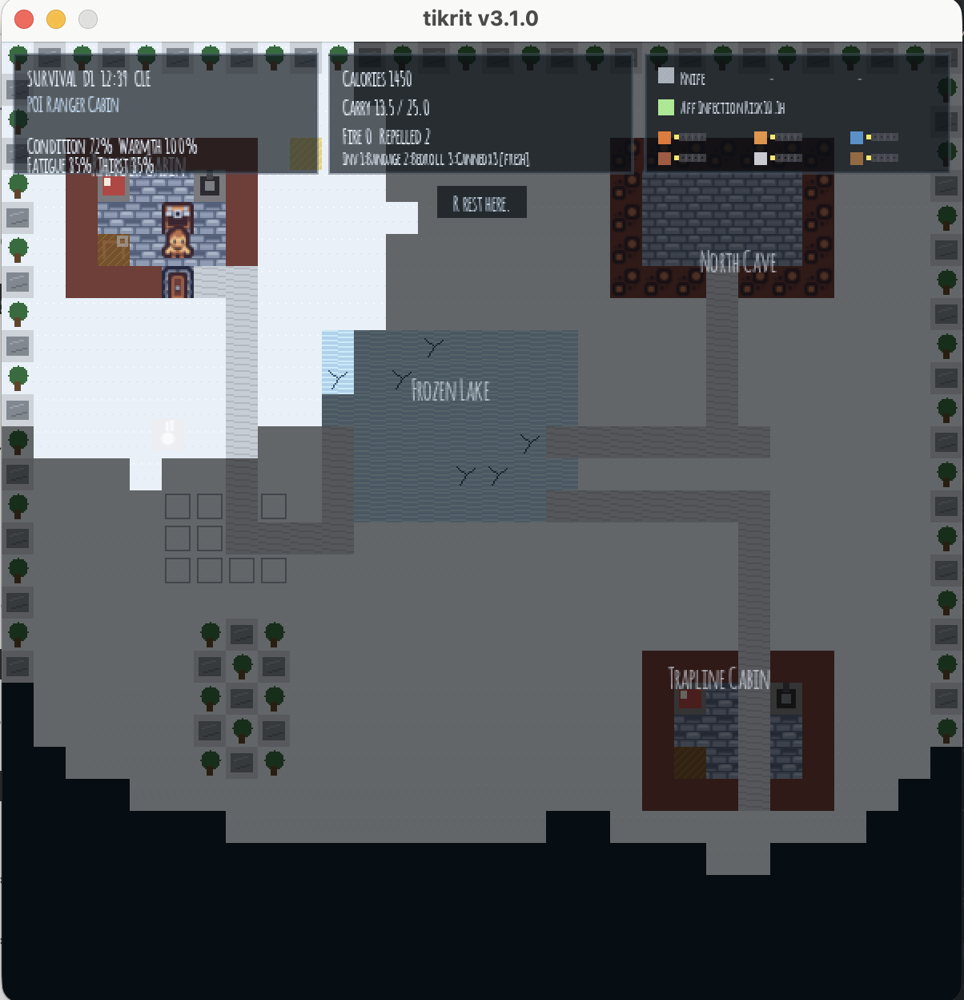

[](https://github.com/gongahkia/tikrit/releases/tag/1.0)
[](https://github.com/gongahkia/tikrit/releases/tag/2.0)

# Tikrit

Tiny survival-horror [roguelike](https://en.wikipedia.org/wiki/Roguelike) written in [Lua](https://www.lua.org/) using Love2D.

## Usage

```console
$ git clone https://github.com/gongahkia/tikrit
$ ./install.sh
$ ./build.sh
$ make
$ make test # optionally
```

## Screenshot





## Assets

* Sprites from Kenney's [tiny dungeon asset pack](https://kenney.nl/assets/tiny-dungeon) 
* Audio from [OpenGameArt](https://opengameart.org/)

## Reference

